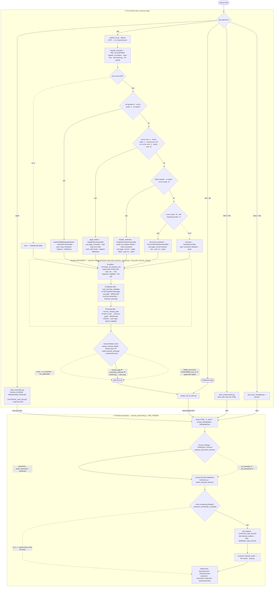

# The import-conversion decision tree

> **The folder layout IS the tree** (Phase 2 reorg): `app/Python/ingestion/<format>/` reads each format
> into common HTML; `app/Python/digestion/<stage>/` is the shared pipeline over it; `app/Python/shared/`
> is cross-cutting. The structure is therefore GENERATED from the folders —
> [`PIPELINE_STRUCTURE.generated.md`](PIPELINE_STRUCTURE.generated.md) (by `gen_pipeline_tree.py`), and
> the per-node notes from each unit's `plain` attribute ([`pipeline_notes.json`](pipeline_notes.json) by
> `gen_pipeline_tree.py`/`gen_pipeline_notes.py`). Both are drift-gated by `unit/test_pipeline_map.py`.
> The live backend still invokes the old flat script paths via thin re-export shims (see each shim's
> header). `pipeline_map.json` remains the data the completeness gate enforces; this page is the
> hand-drawn Mermaid of the decision FLOW (gates/branches), which folders alone don't capture.

**The one meta-insight (drives diagnosis):** every **frontend's** job is to produce the **backend's
input**. `process_document.py` is *HTML-in*. So `epub` / `html` / `docx` converge straight to HTML;
`pdf` / `md` take a **markdown detour** first. The *type* each frontend detects — a PDF footnote
**layout**, an EPUB footnote **scheme**, a document **strategy** — is what drives downstream linking.

> **Corollary:** if an expected artifact (a footnote, a citation) is **absent from the frontend's
> intermediate** (`main-text.md` for PDF, `main-text.html` for EPUB), the bug is **UPSTREAM in that
> frontend**. If it's **present in the intermediate but unlinked**, the bug is **downstream in the
> backend linker**. Localize before editing.

> **The PDF frontend mechanizes that corollary** via `assess_harvest_fidelity` (the `pdf.fidelity`
> node, after the assemblers). For footnotes the "absent vs present" split is three-way, and the check
> emits which one into `assessment.json` so the vibe loop routes correctly — it compares what the OCR
> captured (`page_summary` refs/defs) against what we emitted (the markdown):
>
> | verdict | meaning | whose bug | flagged? |
> |---|---|---|---|
> | `harvest_gap` | OCR captured the defs, our assembler dropped them | ours (fix harvest) | ⚑ yes |
> | `assembly_collisions` | defs emitted but global numbers aren't unique | ours (fix numbering/offset) | ⚑ yes |
> | `fidelity_loss` | OCR itself lost the defs the body references | upstream OCR ceiling | no |
> | `clean` / `no_footnotes` / `not_applicable` | nothing to fix (or non-harvesting layout) | — | no |
>
> "Demand" is anchored on the in-text **markers** (refs), not the raw def-line count — def-shaped
> lines are inflated by numbered-list noise, so a book with 0 real footnotes can show 400 `N.` lines.
> Only the two genuinely-ours buckets raise the `confidence < 0.5` flag the vibe loop chases.
>
> **`fidelity_loss` is not a dead end — it's the bucket the pypdf resurrection targets.** Before this
> verdict gives up, three layers have already tried to claw the notes back: the `.46 This`→`[^46]`
> regex (`convert_footnotes`), `scan_footnote_mojibake` (re-OCRs garbled pages via pypdf), and the
> `assemble_markdown` pypdf fallback (refs with no def → pulled from the PDF bytes). The fidelity record
> reads their outcome (`footnote_warnings`): `pypdf_unrecovered > 0` = pypdf **also** failed →
> *confirmed* upstream; `pypdf_recovery_attempted = false` = no source PDF in this run → *untested*, the
> real import may still recover some. The pypdf layers need the actual PDF, so they only run live (and
> in the opt-in `test_pdf_recovery_real.py`, `RUN_PYPDF_RECOVERY=1`); the replay harness uses
> `pdf_path=None` for determinism, which is the blind spot that test exists to cover.

---

## The live pathway



## The tree (ASCII, with dead-ends ✗ and no-ops ∅)

```
IMPORT ─ by file extension  (ProcessDocumentImportJob match)
├─ FRONTEND  (normalize → the backend's input; DETECT a "type")
│  ├─ EPUB  epub_normalizer.py        GOAL → main-text.html  (HTML of a footnote SCHEME)
│  │     orchestrator + TRANSFORM_PIPELINE; EpubTransform base in epub_base.py leaf; phase classes
│  │     split into siblings (folders mirror the tree): unzip+combine (epub_normalizer) →
│  │     structuralNormalisation.py → headingMatching.py → footnoteMatching.py → bibliographyDetection.py
│  │     → finalNormalisation.py
│  │     styleProfiler.py (zero-import leaf): the CSS "universal key" — parses the stylesheet into per-class
│  │     typographic fingerprints + toc.ncx (TocIndex); feeds StyleHeadingDetector + StyledSuperscript-
│  │     FootnoteDetector to recover headings/footnotes from OBFUSCATED (cooked) EPUBs by appearance
│  │     TRANSFORM_PIPELINE: structural-normalise → heading-detect → footnote-detect
│  │       {epub3_semantic|aria_role|class_pattern|anchor_heading|notes_class|
│  │        endnote_characters|table|heuristic | pre_processed ∅ | none ✗}  → FOOTNOTE_LINK_RULES
│  ├─ PDF   mistral_ocr.py             GOAL → main-text.md   (MARKDOWN of a footnote LAYOUT)
│  │     orchestrator + re-exports; phase classes split into siblings (folders mirror the tree):
│  │     pdf_shared.py (bases + helpers leaf) · ocrFetch.py · classification.py · assembly.py · recovery.py
│  │     OCR→ocr_response.json ∅replay · PDF_CLASSIFIERS {none|page_bottom|chapter_endnotes|
│  │       document_endnotes|wackSTEMbibliographyNotes | unknown ✗} · renumber[cond] · segments ·
│  │       PDF_ASSEMBLERS(per layout) ·
│  │       RECOVERY ①markers normalize_all_footnote_refs (no pdf) · ②mojibake scan_footnote_mojibake
│  │         (pypdf, needs pdf) · ③missing-def recover_missing_defs (pypdf, needs pdf) ·
│  │       assess_harvest_fidelity {clean|harvest_gap⚑|assembly_collisions⚑|fidelity_loss|
│  │         not_applicable | no_footnotes ∅}  →assessment.json  → simple_md_to_html.py
│  │     [tests: test_footnote_recovery.py · test_pdf_recovery_real.py(opt-in) · test_harvest_fidelity.py]
│  ├─ MD    simple_md_to_html.py → intermediate.html
│  ├─ HTML  ar5iv_preprocessor.py (arXiv only, else raw) → html
│  └─ DOCX  strip_docx_metadata.py + pandoc → html
└─ BACKEND  process_document.py (DOC_PASSES, the orchestrator) · _doc_shared.py (shared helpers)  GOAL → nodes + footnotes + references + audit + assessment
   ├─ LOAD     load.py — LoadDocument(+footnote_meta→is_stem) · SafariRtlFix · SplitBibliographyParagraphs · [STEM wackSTEM branch]
   ├─ EXTRACT  bibliography.py(extract_bibliography) · strategy.py(analyze_document_structure →
   │           STRATEGY_RULES {sequential|whole_document|sectioned | no_footnotes ✗ | pre_processed ∅})
   │           · footnotes.py + strategy.py(detect_footnote_sections)
   │           · _footnote_numbering_is_linkable  [GUARD → extract-but-DON'T-link ∅]
   │           [DocPasses: bib_passes.py · strategy_pass.py · footnote_passes.py]
   ├─ LINK     citations.py→CITATION_LINK_RULES · footnotes.py→MARKER_LINK_RULES
   │           [DocPasses: citation_pass.py · footnote_link_pass.py]
   ├─ AUDIT    audit.py(compute_footnote_audit → verdict)  [DocPass: audit_pass.py]
   └─ FINAL    finalize.py — structural_coverage (flag) · strip_styling_spans (no spans in DB) ·
               GenerateNodeChunks · sanitize.py → *.jsonl / references.json
```

## Per-pathway goal (what each frontend produces, and the type it detects)

| filetype | frontend script | invoked by | intermediate goal | type detected |
|---|---|---|---|---|
| **epub** | `epub_normalizer.py` | `EpubProcessor.php:173` | `main-text.html` | footnote **scheme** (`TRANSFORM_PIPELINE`) |
| **pdf** | `mistral_ocr.py` → `simple_md_to_html.py` | `PdfProcessor.php:61` | `main-text.md` → html | footnote **layout** (`PDF_CLASSIFIERS`) |
| **md / zip** | `simple_md_to_html.py` | `MarkdownProcessor.php:95` | `intermediate.html` | (markers → sequential strategy) |
| **html** | `ar5iv_preprocessor.py` (cond.) | `HtmlProcessor.php:75` | normalised html | ar5iv/LaTeXML vs raw |
| **docx** | `strip_docx_metadata.py` + pandoc | `PandocConversionJob.php:45` | html | — |
| **(all)** | `process_document.py` | 4 processors | nodes/footnotes/references | **strategy** (`STRATEGY_RULES`) |

## Decision registries (the open/closed extension points — `op:register` targets)

| registry | file | band | of |
|---|---|---|---|
| `TRANSFORM_PIPELINE` | `epub_normalizer.py` | frontend | EpubTransform footnote/structure detectors |
| `PDF_CLASSIFIERS` | `mistral_ocr.py` | frontend | PdfClassifier (footnote layout) |
| `PDF_ASSEMBLERS` | `mistral_ocr.py` | frontend | FootnoteAssembler (per layout) |
| `DOC_PASSES` | `process_document.py` | backend | DocPass (ordered backend passes) |
| `STRATEGY_RULES` | `conversion/strategy.py` | backend | StrategyRule (strategy decision) |
| `CITATION_LINK_RULES` | `conversion/citation_link_rules.py` | backend | LinkRule (citation linking) |
| `MARKER_LINK_RULES` | `conversion/footnote_link_rules.py` | backend | LinkRule (in-text marker linking) |
| `FOOTNOTE_LINK_RULES` | `conversion/footnote_link_rules.py` | backend/frontend | LinkRule (epub footnote linking) |

## Shared libraries (cross-cutting, every backend stage)

`conversion/refkeys.py` (citation keys) · `conversion/sanitize.py` (HTML/URL sanitise) ·
`conversion/assessment.py` (the decision trace → `assessment.json`) ·
`conversion/pipeline_base.py` (`DocPass`) · `conversion/link_base.py` (`LinkRule`).

---

## Appendix — modules NOT in the live import pathway (accounted for, flagged)

The completeness gate forces these to be classified too. They are the "dead ends" of the *codebase*.

### Other subsystems (live, but not import-conversion)
- The **vibe self-improving loop** — the `vibeConverter/` package (invoked by `VibeConversionJob.php` via
  the `vibe_convert.py` shim, not by an import). One file per stage:
  `runtime.py` (zero-import leaf: constants + mutable run state) → `artifacts.py` (read artifacts) →
  `diagnosis.py` (flag problem forks) → `routing.py` (which modules to send + issue narration) →
  `samplers.py` (marker/def/ref evidence) → `prompt.py` (assemble the prompt) → `propose.py` (LLM call) →
  `patch.py` (AST patch engine) → `sandbox.py` (throwaway copy + re-convert) → `gate.py` (accept/reject) →
  `report.py` (persist + GitHub issue) → `loop.py` (bounded-retry orchestrator) → `apply.py` (apply +
  regenerate) → `cli.py` (CLI entry). Plus `vibe_aider.py` · `vibe_aider_gate.py` (the aider edit-gen
  engine) and `conversion/fix_categories.py` (the fix taxonomy).
- `footnote-jason.py` — the **footnotes-refresh** endpoint (`FootnotesController.php:50`).

### Legacy / superseded (still on disk — deletion candidates)
- `html_footnote_processor.py`, `preprocess_html.py` — the old HTML path; **superseded by
  `process_document.py`** (the "legacy pair" comment, `HtmlProcessor.php:106-116`).
- `epub_processor.py` — superseded by `epub_normalizer.py` (only named in a stale comment).
- `process_footnotes.py` ("STANDALONE") · `process_references.py` ("DEFINITIVE VERSION") — standalone
  pre-decomposition versions of `conversion/footnotes.py` / `conversion/bibliography.py`.

### Dead orphans (no references anywhere — deletion candidates)
- `extract_text.py` (hardcodes `king2019imperialism.pdf`) · `normalize_headings.py` · `resume.py`
  (a markdown→pdf PoC; `convert_markdown_to_pdf` is never called).

> Removing the 8 legacy/dead modules would de-clutter `app/Python` and stop them confusing the vibe
> loop's `code_ref` routing — a candidate follow-up, tracked here so they're never mistaken for live.
